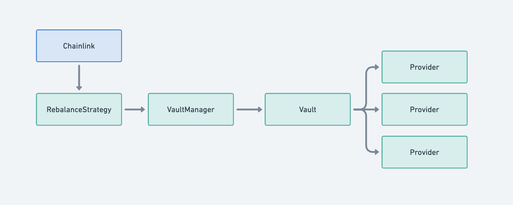

# Decentralized Rebalancing

Rebalance Finance relies on Chainlink Automation for automatic rebalancing of its vaults. With this approach Chainlink does not have any decision-making role nor power, acting solely as the initiator of rebalance transactions, but not deciding when and how to rebalance. Because a smart contract cannot initiate a transaction by itself, an initiator is required. RebalanceStrategy smart contract determines whether it's time to rebalance and how the funds should be allocated. Thus Chainlink provides the convenience of automation and the decentralization of the rebalancing process without having any power over the funds nor over the choice of their allocation.

## Architecture

Chainlink regularly calls the RebalanceStrategy contract to check if it's time to rebalance. If it is, it initiates a rebalance transaction. RebalanceStrategy then calls VaultManager to rebalance the Vault.

Every Vault has a set of Providers connected to lending protocols. Each provider represents a single lending protocol. The Vault can allocate the funds only among those Providers. Rebalancing of the Vault reallocates the funds among its Providers according to the strategy defined in the RebalanceStrategy contract to maximize the yield.

## RebalanceStrategy

RebalanceStrategy checks every Provider's APR to decide when to rebalance the Vault and how to reallocate the funds among them.

It has two main functions that make it compatible with Chainlink Automation:

1. `checkUpkeep` - view function that checks if it's time to rebalance the Vault
2. `performUpkeep` - function that performs the rebalancing of the Vault

Chainlink makes sure to regularly call `checkUpkeep` and whenever it signals that it's time to rebalance, it calls `performUpkeep`.

### Privileges

RebalanceStrategy only allows Chainlink's Forwarder to call `performUpkeep`. Chainlink creates a new Forwarder contract for every new Chainlink Upkeep, so after the creation of each Upkeep we set the Forwarder address in the RebalanceStrategy contract by calling `setForwarder(address)`. The function `setForwarder()` can only be called once.

The owner of the RebalanceStrategy contract can update the rebalance settings by calling `updateSettings()` to change the rebalance interval and the minimum rate delta. This affects how often the rebalance will be performed.

RebalanceStrategy has the Executor role in VaultManager which allows it to rebalance the Vault.

## Security

The worst-case scenario is that Chainlink Automation stops working, which means that automatic rebalancing of fund distribution will be temporarily paused. The funds themselves remain safe at all times and in all cases and can be withdrawn by the user at any time regardless of the rebalancing process.

